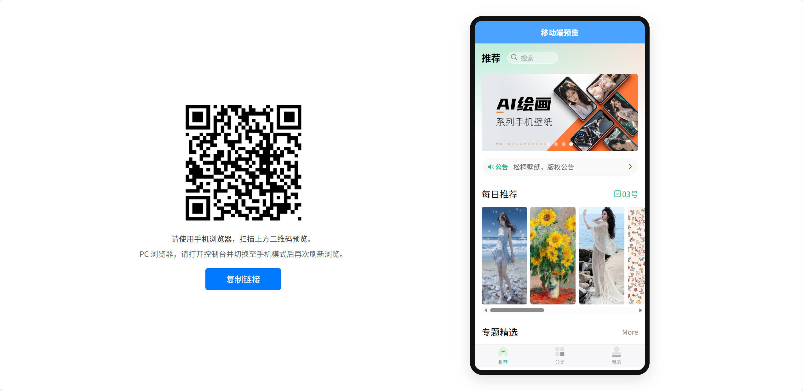

# 松桐壁纸

一个基于 uni-app 开发的跨平台壁纸应用，支持 H5、微信小程序、APP 等多个平台。提供丰富的壁纸资源，支持分类浏览、搜索、下载、评分等功能。
<p float="left">
  
</p>

## 项目简介

松桐壁纸是一个学习与实践的 uni-app 项目，提供精美的手机壁纸浏览和下载服务。项目采用 Vue3 + uni-app 开发，支持多端发布，用户体验流畅，界面美观。

## 功能特性

### 核心功能
- **首页推荐** - 轮播图展示、每日推荐壁纸、专题精选
- **分类浏览** - 多种分类主题，支持分类详情列表
- **搜索功能** - 关键词搜索壁纸，支持历史搜索记录
- **壁纸预览** - 高清预览，支持滑动切换
- **壁纸下载** - 一键保存到相册（小程序/App）
- **评分功能** - 为喜欢的壁纸进行评分
- **公告系统** - 查看应用公告和资讯详情
- **个人中心** - 查看下载历史、评分记录等

### 用户体验
- 自定义导航栏，适配不同平台
- 响应式设计，支持 PC 端自动跳转
- 下拉刷新、上拉加载更多
- 本地缓存，提升加载速度
- 小程序分享功能
- 美观的 UI 设计

## 技术栈

- **框架**: uni-app (Vue3)
- **构建工具**: Vite
- **UI组件**: uni-ui、uv-ui
- **样式**: SCSS
- **代码规范**: ESLint

### 主要依赖

```json
{
  "qrcode": "^1.5.4"  // 二维码生成（PC端使用）
}
```

## 项目结构

```
wallpaper-demo/
├── api/                    # API 接口
│   ├── apis.js            # 接口定义
│   └── mock.js            # Mock 数据
├── components/            # 组件
│   ├── common-title/      # 通用标题组件
│   ├── custom-nav-bar/    # 自定义导航栏
│   └── theme-item/        # 主题项组件
├── pages/                 # 页面
│   ├── index/             # 首页（推荐）
│   ├── classify/          # 分类页
│   ├── classList/         # 分类列表页
│   ├── preview/           # 壁纸预览页
│   ├── search/            # 搜索页
│   ├── notice/            # 公告列表/详情
│   ├── user/              # 个人中心
│   └── pcHome/            # PC 端首页
├── static/                # 静态资源
├── common/                # 公共资源
│   ├── images/            # 图片资源
│   └── style/             # 样式文件
├── utils/                 # 工具函数
│   ├── request.js         # 网络请求封装
│   ├── common.js          # 通用工具
│   └── stystem.js         # 系统信息工具
├── uni_modules/           # uni-app 插件
├── App.vue                # 应用入口
├── main.js                # 入口文件
├── manifest.json          # 应用配置
├── pages.json             # 页面配置
├── vite.config.js         # Vite 配置
└── package.json           # 依赖配置
```

## 环境要求

- Node.js >= 14.0.0
- HBuilderX 或 支持 uni-app 的开发工具
- 微信开发者工具（开发微信小程序时需要）

## 快速开始

### 安装依赖

```bash
# 使用 npm
npm install

# 或使用 yarn
yarn install

# 或使用 pnpm
pnpm install
```

### 开发运行

#### H5 开发
```bash
# 使用 HBuilderX
# 1. 打开项目
# 2. 运行 -> 运行到浏览器 -> Chrome

# 或使用命令行（如果配置了 npm scripts）
npm run dev:h5
```

#### 微信小程序
```bash
# 使用 HBuilderX
# 1. 运行 -> 运行到小程序模拟器 -> 微信开发者工具

# 注意：需要先在 manifest.json 中配置小程序 AppID
```

#### APP 开发
```bash
# 使用 HBuilderX
# 1. 运行 -> 运行到手机或模拟器 -> 选择设备
```

### 生产构建

```bash
# H5 构建
npm run build:h5

# 微信小程序构建
npm run build:mp-weixin

# APP 构建（需使用 HBuilderX）
# 发行 -> 原生 App-云打包
```

## 配置说明

### manifest.json 配置

**重要**：首次运行项目前，需要创建并配置 `manifest.json` 文件。

1. 复制配置文件模板：
   ```bash
   cp manifest.example.json manifest.json
   ```

2. 编辑 `manifest.json`，填入你的微信小程序 AppID：
   ```json
   {
     "mp-weixin": {
       "appid": "your-wechat-appid-here"
     }
   }
   ```

**注意**：`manifest.json` 文件已添加到 `.gitignore`，不会被提交到 Git，请妥善保管。

### API 密钥配置

**重要**：首次运行项目前，需要配置 API 访问密钥。

1. 复制配置文件模板：
   ```bash
   cp utils/config.example.js utils/config.js
   ```

2. 编辑 `utils/config.js`，填入实际的 API 访问密钥：
   ```javascript
   export default {
     accessKey: "your-access-key-here"
   }
   ```

**注意**：`utils/config.js` 文件已添加到 `.gitignore`，不会被提交到 Git，请妥善保管。

### API 地址配置

在 `utils/request.js` 中配置 API 基础地址：

```javascript
// 默认 API 地址（小程序/App）
let BASE_URL = 'https://tea.qingnian8.com/api/bizhi'

// H5 环境使用代理（在 vite.config.js 中配置）
/* #ifdef H5 */
BASE_URL = '/api/bizhi'
/* #endif */
```

### Vite 代理配置

在 `vite.config.js` 中配置开发代理：

```javascript
server: {
  proxy: {
    '/api': {
      target: 'https://tea.qingnian8.com',
      changeOrigin: true,
      secure: true
    }
  }
}
```


### Mock 数据

在 `api/apis.js` 中可通过 `USE_MOCK` 开关控制是否使用 Mock 数据：

```javascript
const USE_MOCK = true  // 设置为 false 使用真实 API
```

## 平台支持

| 平台 | 支持状态 | 说明 |
|------|---------|------|
| H5 | 支持 | 完整功能，支持 PC 端自动跳转 |
| 微信小程序 | 支持 | 完整功能，需配置 AppID |
| Android App | 支持 | 完整功能，需配置打包证书 |
| iOS App | 支持 | 完整功能，需配置打包证书 |
| 其他小程序 | 部分支持 | 根据 uni-app 兼容性 |

## 注意事项

1. **API 地址**: 需要配置正确的 API 服务地址
2. **小程序 AppID**: 开发微信小程序前需要配置 AppID
3. **图片资源**: 部分图片资源需要替换为实际资源
4. **权限配置**: App 端下载功能需要配置相册权限
5. **网络请求**: 确保网络请求域名已在小程序后台配置白名单
6. **错误处理**: 建议为所有异步操作添加错误处理（参考项目检查报告）

## 相关文档

- [uni-app 官方文档](https://uniapp.dcloud.net.cn/)
- [Vue3 官方文档](https://cn.vuejs.org/)
- [Vite 官方文档](https://cn.vitejs.dev/)

## 版权说明

本项目学习自 UP 主咸虾米的开源项目，仅用于学习与交流。

项目中的图片资源来源于互联网或用户上传，版权归原作者所有。如发现内容侵权，请联系处理。

本项目为非商业用途，对可能造成的不便敬请谅解。

## 许可证

本项目仅供学习交流使用。

---

**注意**: 这是一个学习项目，请勿用于商业用途。
